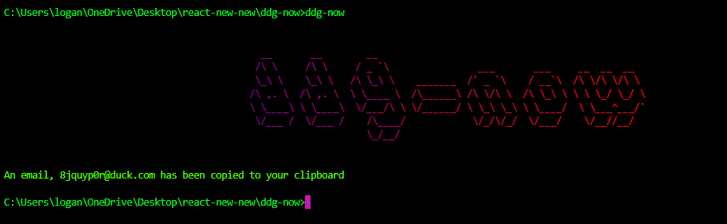

# ddg-now

This is a command-line application that allows you to get a random `duck.com` email address.

This is an alternative to the [Extension by Duck Duck Go](https://duckduckgo.com/email/), but does not require you to
change your default search engine to Duck Duck Go, unlike the extension.

# Installation
1) Clone the project
2) cd into dir
3) run `npm install` in dir
4) run `npm run build` in the dir
5) run `ddg-now` on the command-line whenever you need an email.

# Screen shot

